# GHformats

<!-- [](https://github.com/gh-dhintz/GHformats/actions/workflows/check-standard.yaml) -->

## Attribution

**GHformats** is a derivative work based on the
[UHHformats](https://github.com/uham-bio/UHHformats) package by Saskia
Otto, licensed under [CC BY
4.0](https://creativecommons.org/licenses/by/4.0/). This package has
been adapted and rebranded for use at Guardant Health.

**Original work**: UHHformats by Saskia Otto
**Derivative work**: GHformats by Daniel Hintz
**License**: CC BY 4.0 (Creative Commons Attribution 4.0 International)

------------------------------------------------------------------------

This R package provides ready-to-use R Markdown and **now also Quarto
templates** for HTML, PDF and Microsoft Word output formats, which are
used within Guardant Health. The package aims to encourage reproducible
research using simple Markdown syntax while embedding all of the R code
to produce plots and analyses as well. Included in the package are
templates for

- Simple PDF Reports 
  - [R Markdown: Simple PDF document in English (default) or German -
    `pdf_simple`](#r-markdown-simple-pdf-document-in-english-default-or-german---pdf_simple)
  - [Quarto: Output format for a simple PDF document in English
    (default) or German -
    `pdf_simple`](#quarto-output-format-for-a-simple-pdf-document-in-english-default-or-german---pdf_simple)
- HTML files
  - [R Markdown: HTML document (simple design) -
    `html_simple`](#r-markdown-html-document-simple-design---html_simple)
  - [R Markdown: HTML document (with bootstrap design ‘Material’) -
    `html_material`](#r-markdown-html-document-with-bootstrap-design-material---html_material)
  - [Quarto: Simple HTML output format -
    `html`](#quarto-simple-html-output-format---html)
- Enhanced PDF reports (with toc and company logos)
  - [R Markdown: Guardant Health report in English (default) or German -
    `pdf_report`](#r-markdown-guardant-health-report-in-english-default-or-german---pdf_report)
  - [Quarto: Output format for a PDF report in English (default) or
    German -
    `pdf_report`](#quarto-output-format-for-a-pdf-report-in-english-default-or-german---pdf_report)
- Cheat Sheets
  - [R Markdown: Output format for a simple cheat sheet (PDF) -
    `pdf_cheatsheet`](#r-markdown-output-format-for-a-simple-cheat-sheet-pdf---pdf_cheatsheet)
- MS Word documents
  - [R Markdown: Simple Microsoft Word document -
    `word_doc`](#r-markdown-simple-microsoft-word-document---word_doc)
  - [Quarto: Simple Microsoft Word output format -
    `word`](#quarto-simple-microsoft-word-output-format---word)
- Conversions from R Markdown documents to Jupyter Notebooks
  - [R Markdown: Jupyter Notebook output format -
    `rmd_to_jupyter`](#r-markdown-jupyter-notebook-output-format---rmd_to_jupyter)

The default font for PDF and Word templates is ‘HelveticaNeue’, with
‘Helvetica’ available as an alternative. HTML templates use Roboto font
(embedded web fonts). Most templates include the Guardant Health logo
and branding, but the logo can easily be replaced in the YAML header and
also the style can be modified, by e.g. adding your own CSS stylesheet
in the YAML header of the HTML template.

Many templates were developed based on other inspiring templates and R
packages, which are mentioned below. **To help getting started, all
templates contain already some example text and code** for formatting
text, writing equations, creating tables and figures with
cross-references and including references.

**NEW in this version**:

- Templates focus on reports and analyses for data science workflows.
- Small design makeover of various templates.
- A new Word template for R Markdown was added.
- This package also contains now templates for Quarto documents that
  generate HTML, PDF, and MS Word output (see [Quarto template
  gallery](#quarto-template-gallery)). [Quarto](https://quarto.org) is a
  next generation version of R Markdown from RStudio, which supports
  more languages and environments such as Python, Julia, or Jupyter.
  Like R Markdown, Quarto uses Knitr to execute R code, and is therefore
  able to render most existing Rmd files without modification.

## Installation

Install the development version from GitHub using the *remotes* package:

``` r
if (!require("remotes")) install.packages("remotes")
remotes::install_github("gh-dhintz/GHformats", build_vignettes = TRUE)
```

Make sure that you also have the latest versions of the R packages
*rmarkdown* and *knitr* installed. For some R Markdown templates you
also need the R package *bookdown*.

``` r
if (!require("rmarkdown")) install.packages("rmarkdown")
if (!require("knitr")) install.packages("knitr")
if (!require("bookdown")) install.packages("bookdown")
```

If you are more interested in the Quarto templates make sure that you
have the Quarto CLI on your machine installed:
<https://quarto.org/docs/get-started/>. To render the .qmd documents
directly from the console you need to have the Quarto R package
installed:

``` r
if (!require("quarto")) install.packages("quarto")
```

## Getting started

### R Markdown documents

#### Creating a new document and rendering it within R Studio

Once you installed the package you might need to close and re-open R
Studio to see the `GHformats` templates listed.

1.  Choose **File** \> **New File** \> **R Markdown**, then select
    **From Template**. You should then be able to create a new document
    from one of the package templates:

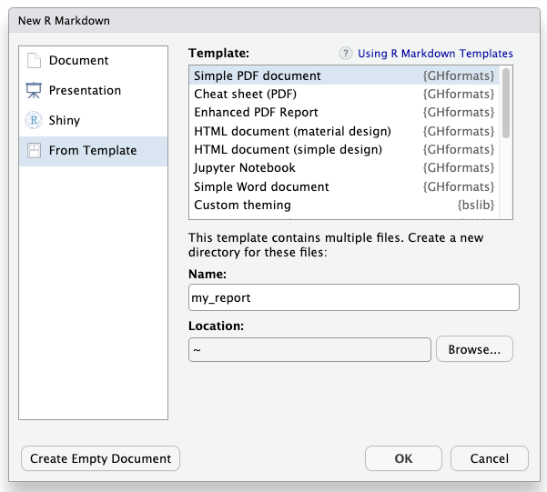

2.  Choose the directory in which you want to save your file and provide
    a file name (that name will be used for both the .Rmd file and the
    new folder in which the .Rmd file will be placed).

3.  If you are interested in the documentation already provided in the
    template file for getting started, render the document once before
    you start changing the content (click the `Knit` button).

#### Without R Studio

You can create a new directory inside your current directory, including
the ready-to-use R Markdown file and all associated files (e.g. images,
fonts, LaTeX templates, etc.), with the built-in function
`create_rmd_doc()`, which is adopted from the
[rmdformats](https://github.com/juba/rmdformats) package.

Use, for instance,

``` r
GHformats::create_rmd_doc(dirname = "new_doc", template = "pdf_report")
```

to generate a report-like PDF output.

Alternatively, use

``` r
rmarkdown::draft("new_doc.Rmd", template = "html_simple", package = "GHformats")
```

These functions will automatically create the subdirectory and place the
generated .Rmd file and all associated files and folders into it.

You can render your document into the HTML, PDF or Word output format
using the `render()` function from the `rmarkdown` package :

``` r
setwd("./new-doc")
rmarkdown::render("new-doc.Rmd")
```

**Important note**: `rmarkdown::render` uses as default Pandoc to
convert the Markdown document into HTML or PDF. While R Studio uses its
internal Pandoc installation (e.g., on a Mac located in ‘/Applications/R
Studio.app/Contents/MacOS/pandoc/’), you need to have Pandoc and its
citation parser also installed on your system. See
<https://pandoc.org/installing.html> for instructions. This book chapter
is also helpful:
<https://bookdown.org/yihui/rmarkdown-cookbook/install-pandoc.html>

### Quarto documents

Quarto templates are currently not supported in RStudios IDE. Until that
changes, you can access these templates with the `create_quarto_doc()`
function. The function has three arguments: `dirname` for the name of
the subdirectory (and .qmd file), `template` for the output types
(choose from ‘html’, ‘pdf_simple’, ‘pdf_report’ or ‘word’) and `font`
for the font type. If the output format is PDF or Word you can choose
between ‘HelveticaNeue’ (default) and ‘Helvetica’. The function will
copy the .qmd files and associated files and folders into this new
subdirectory

Use, for instance,

``` r
GHformats::create_qmd_doc(dirname = "my_html_doc", template = "html")
GHformats::create_qmd_doc(dirname = "my_pdf_doc", template = "pdf_simple")
```

to generate a HTML page with the browsers default font or a simple PDF
document with Guardant Health’s corporate font (HelveticaNeue).

If you are using RStudio, go in the files manager to your new
subdirectory, open the .qmd file and click on the **Render** button. For
HTML output, you can use alternatively the `quarto_render()` function
from the *quarto* package:

``` r
setwd("./my_html_doc")
quarto::quarto_render("my_html_doc.qmd",  output_format = "html")
```

### Further requirements - LaTeX

In addition to Pandoc or R Studio being installed, you need to have
[LaTeX](https://www.latex-project.org/about/) installed if you want to
use the templates that convert R Markdown to PDF output formats.
Depending on your operating systems there are different distributions
you can use, e.g. for Mac there is [MacTeX](http://www.tug.org/mactex/),
which includes [TeXShop](https://pages.uoregon.edu/koch/texshop/), a
nice Mac-only editor for .tex documents. For other OS see here:
<https://www.latex-project.org/get/>

An easy way to install LaTeX on any platform is with the
[tinytex](https://yihui.org/tinytex/) R package:

``` r
install.packages('tinytex')
tinytex::install_tinytex()
# After restarting R Studio, confirm that you have LaTeX with 
tinytex:::is_tinytex() 
```

TinyTeX is a custom LaTeX distribution based on TeX Live that is small
in size but that includes most relevant functions (for R users). You
may, however, still need to install a few extra LaTeX packages on your
first attempt to knit when you use this package.

Although LaTeX is a powerful and popular tool in Academia, it can take a
while to learn the syntax and to find the correct formatting. R Markdown
and the PDF template in this packages offer a much simpler syntax and
the direct embedding of figures and tables, but at the cost of loosing
some of the expressiveness of LaTeX. However, you can insert LaTeX code
directly into the R Markdown files and also add LaTeX packages and
format styles in the YAML header.

If you want to know more about LaTeX, a good start is the *overleaf*
tutorial (and its entire documentation):
<https://www.overleaf.com/learn/latex/Learn_LaTeX_in_30_minutes>

------------------------------------------------------------------------

## R Markdown template gallery

### R Markdown: HTML document (simple design) - `html_simple`

→ for an example file see also
[here](https://github.com/gh-dhintz/GHformats/blob/master/resources/examples/demo_rmd_html_simple.html).

This template converts the R Markdown file into a simple HTML file with
a fixed table of content in the upper right corner and a code folding
button similar to R notebooks.

Its function calls internally `rmarkdown::html_document` or
`bookdown::html_document2`. The latter is the default, hence, numbered
section (set to `FALSE` as default) and automatic numbering of figures
and tables is supported. However, please note that the hyperlink in the
cross-reference does not yet work in this template. The basis for this
function and the HTML, CSS, and JavaScript code is the `html_clean`
template developed by Julien Barnier in the
[rmdformats](https://github.com/juba/rmdformats) package.

The current R Markdown template has in the YAML header:

    ---
    title: "Title"
    author: "Name"
    date: "2026-03-09"
    output:
      GHformats::html_simple:
        highlight: kate
        code_folding: show
        use_bookdown: true
        number_sections: false
    editor_options: 
      chunk_output_type: console
    ---

To get an overview of options that can be set in the YAML header besides
`highlight`, `code_folding`, and `number_sections` see the help file for
`html_simple` as well `bookdown::html_document2` or
`rmarkdown::html_document`.

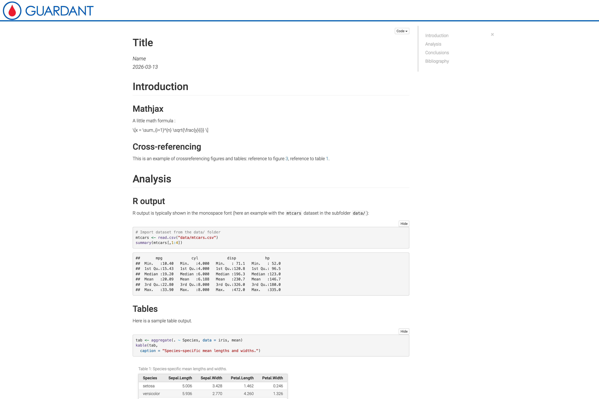

### R Markdown: HTML document (with bootstrap design ‘Material’) - `html_material`

→ for an example file see also
[here](https://github.com/gh-dhintz/GHformats/blob/master/resources/examples/demo_rmd_html_material.html).

This template converts the R Markdown file into an HTML output file that
has a navigation bar on the left and in which the different sections
(defined by setting header level 1 (#)) are displayed on individual
pages or cards. By defualt all sections on a single page, with the option
`cards: false` option in the YAML header. The design is an adaptation
from the Material design theme for Bootstrap 3 project:
<https://github.com/FezVrasta/bootstrap-material-design>. The underlying HTML/JavaScript/CSS and R implementation originated in Julien Barnier’s rmdformats package and was subsequently adapted for the Data Science in Biology program at UHH, then further modified for Guardant Health data science workflows in GHformats.

Similar to `html_simple`, the underlying function calls internally
`rmarkdown::html_document` or (default) `bookdown::html_document2`. But
here, the numbered section is set to `TRUE` as default and also the
hyperlink in the cross-references works. To get an overview of options
that can be set in the YAML header besides `highlight` and
`code_folding`, which are shown as examples in the R Markdown template,
see the help file for `html_material` as well `bookdown::html_document2`
or `rmarkdown::html_document`.

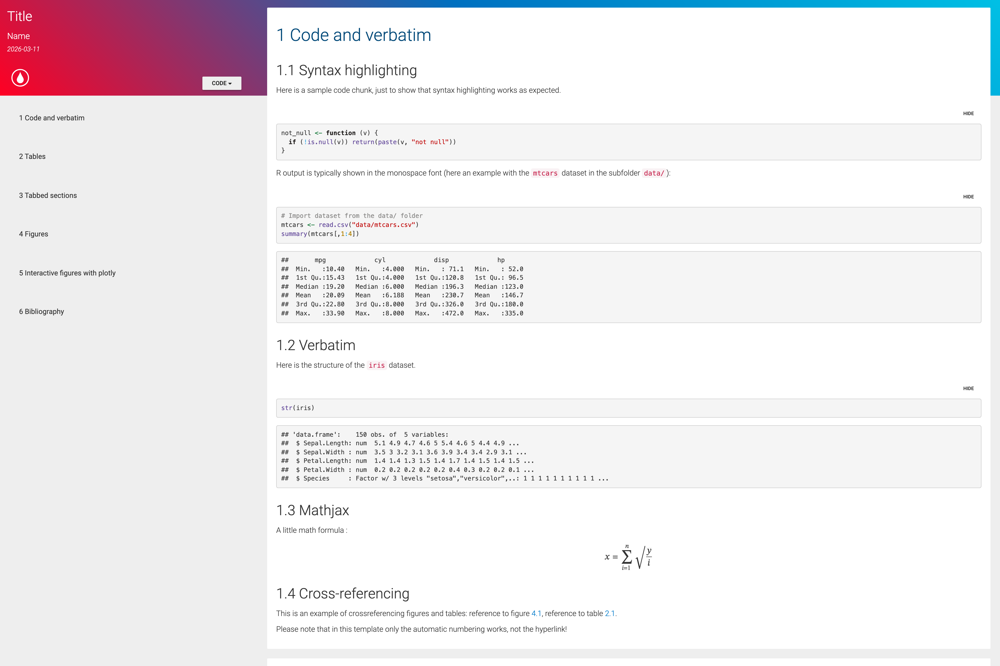

#### Addtional features available in these HTML templates:

Some extra features were adopted from the
[rmdformats](https://github.com/juba/rmdformats) package, i.e. 

- tabsets are supported like in the default template made with
  `rmarkdown::html_document()`
- both templates provide automatic thumbnails for figures with lightbox
  display

### R Markdown: Simple Microsoft Word document - `word_doc`

→ for an example file see also
[here](https://github.com/gh-dhintz/GHformats/blob/master/resources/examples/demo_rmd_word_doc.docx).

This template converts the R Markdown file into a Microsoft Word
document, which is suitable for student assignments or project reports.
The underlying function `word_doc` is a wrapper of
`bookdown::word_document2`. By using internally *bookdown* the language
settings for figure legends and table captions can be automatically
changed from English to German (or any other language).

In the YAML header of the R Markdown template, you can easily customize
the language, font, the bibliography style or whether to include a table
of content and the title of it. By default `word_doc` uses a
‘gh-template’ template file with Guardant Health branding, with the font
type set to ‘HelveticaNeue’.

If you feel like using your own template or the standard Word template
(i.e. the Normal.dot file) simply provide the path to your file or write
“default” for the latter case (*reference_docx: “default”*). You can
also use another font by using the setting *font = “other”* and
replacing the ‘font_XXX.ttf’ files in the working directory with your
own files. Please note, that you have to name these files exactly as the
template font files.

If you set the language to German, a configuration file named
’\_bookdown.yml’ is copied into the working directory, which defines the
labels of the figure legend and table captions. If you want to use other
labels (e.g. ‘Abb.’ instead of ‘Abbildung’) feel free to modify the
file.

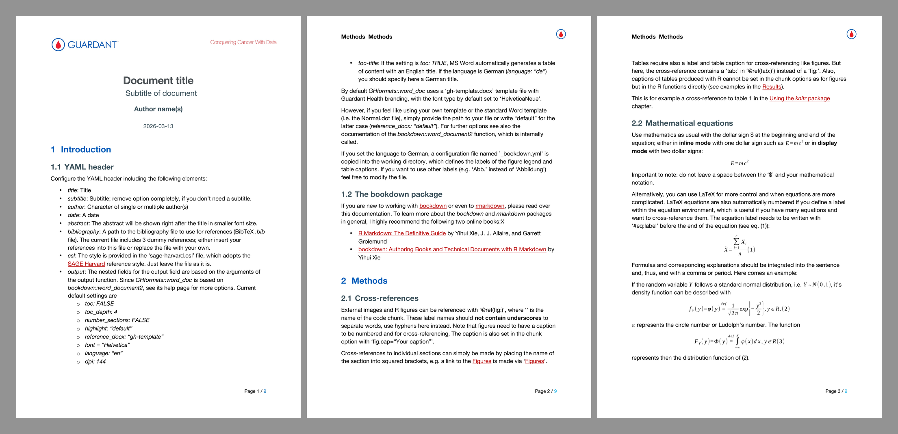

### R Markdown: Simple PDF document in English (default) or German - `pdf_simple`

→ for an example file see also
[here](https://github.com/gh-dhintz/GHformats/blob/master/resources/examples/demo_rmd_pdf_simple.pdf).

This template converts the R Markdown file into a simple PDF/LaTeX -
based document structured as an article, which is suitable for student
assignments. The underlying function `pdf_simple` is a wrapper of
`rmarkdown::pdf_document`. Similar to the `pdf_report` template, the
YAML header offers various options to adjust the layout of the document.

In the YAML header of the R Markdown template, you can easily customize
the logos and cover image, the language, the bibliography style or even
add your own LaTeX style with the `include-after` option:

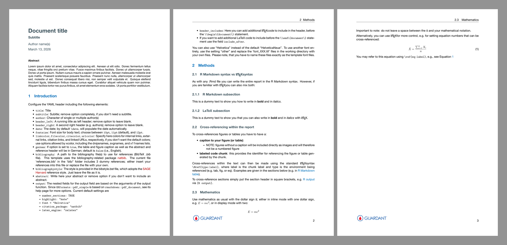

### R Markdown: Guardant Health report in English (default) or German - `pdf_report`

→ for an example file see also
[here](https://github.com/gh-dhintz/GHformats/blob/master/resources/examples/demo_rmd_pdf_report.pdf).

This template converts the R Markdown file into a PDF/LaTeX - based
report suitable for project reports and student assignments. The
underlying function `pdf_report` is a wrapper of
`rmarkdown::pdf_document` and based on the
[rticles](https://github.com/rstudio/rticles) package that provides
templates for various journal articles. The Pandoc LaTeX template and
the report layout are inspired by INWTlab’s
[ireports](https://github.com/INWTlab/ireports) package.

In the YAML header of the R Markdown template, you can easily customize
the logos and cover image, the language, the bibliography style or even
add your own LaTeX style with the `include-after` option:

    ---
    title: "Document title"
    author: "Author name(s)"
    date: \today
    fontsize: 11pt
    german: false
    bibliography: bibfile.bib       
    bibliographystyle: bibstyle.bst
    params:
      cover: images/GH_cover.png
      title_logo_left: images/GH_logo.png
      title_logo_right: images/GH_secondary_logo.png
      logo_small: images/GH_logo_icon.png
    output:
      GHformats::pdf_report:
        df_print: kable
    ---

For more details on available arguments in `pdf_report` (in addition to
`df_print` as shown here) see its help file as well as the help for
`rmarkdown::pdf_document`.

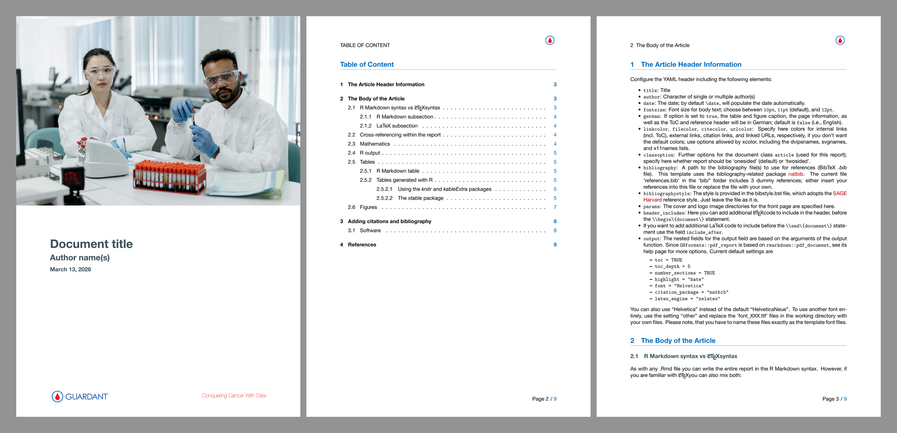

### R Markdown: Output format for a simple cheat sheet (PDF) - `pdf_cheatsheet`

→ for an example file see also
[here](https://github.com/gh-dhintz/GHformats/blob/master/resources/examples/demo_rmd_pdf_cheatsheet.pdf).

Template for creating a simple cheat sheet. The PDF output format will
be A4 sized and horizontal. You can define whether the cheat sheet
should have 2,3,4 or more columns. Also the text and box colors and font
size can be adjusted. The [LaTeX template by Sarah
Lang](https://www.overleaf.com/latex/templates/colourful-cheatsheet-template/qdsshbjktndd)
served here as inspiration for the layout and code.

The templates includes predefined LaTeX commands for textboxes. If you
want to use them to make your cheat sheet visually more appealing, you
have to continue coding in LaTeX unfortunately. I didn’t manage yet to
get around LaTeX overall. However, the template .Rmd file provides
several examples regarding the layout and LaTeX syntax, which is
hopefully sufficient enough for the inexperienced coder.

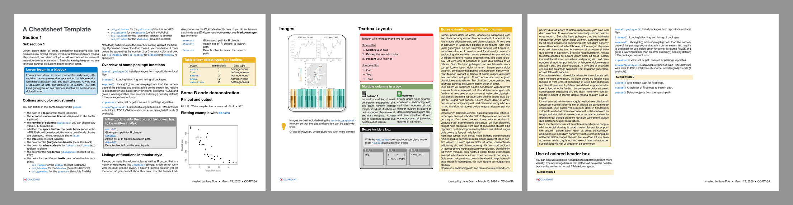

### R Markdown: Jupyter Notebook output format - `rmd_to_jupyter`

→ for an example file see also
[here](https://github.com/gh-dhintz/GHformats/blob/master/resources/examples/demo_rmd_to_jupyter.ipynb).

While I’m a strong advocate of R Studio and R Studio server as IDE for
R, there are times where \[Juypter Notebook\]\[<https://jupyter.org/>\]
is clearly the better option. This package includes the functionality to convert R Markdown files
into Jupyter Notebooks with a approach adapated from the [rmd2jupyter](https://github.com/mkearney/rmd2jupyter) package developed
my Michael Kearney. The underlying function is a custom knit function, which
converts the R Markdown code directly into a prettified JSON string
using `jsonlite::toJSON` and `jsonlite::prettify` and saves it then in
an `.ipynb` file

The only thing you need in the YAML header is therefore:

    ---
    knit: GHformats::rmd_to_jupyter
    ---

Since everything from the YAML header will be cut out when converting
the code, any title, author name or other field will be neglected.

When selecting the *Jupyter Notebook* template in R Studio a directory
including the `.Rmd` file and `images/` subfolder will be created. Open
the R Markdown file and change it however you want. Once you press the
*knit* button you should see a line telling you were the `.ipynb` file
was saved. And you’re done!

When opening your file in Jupyter Notebook, please note that

- if you use a local installation of Jupyter Notebook, the program will
  automatically have access to all the subdirectories that your file
  links to (e.g. the `images/` folder or any `data/` folder)
- if you use Jupyter Notebook server you need to upload the `.ipynb`
  file as well as all subdirectories together as a zip file. To unzip,
  simply open a new R notebook and write into the first cell:
  `unzip("zip_file_name.zip")`.

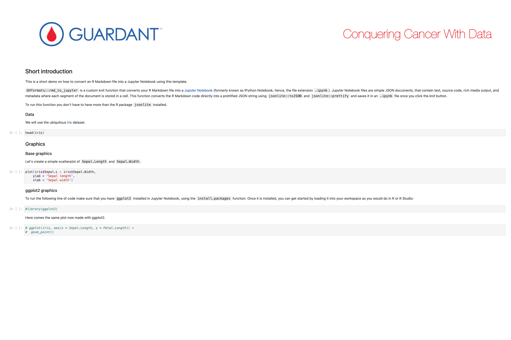

------------------------------------------------------------------------

## Quarto template gallery

### Quarto: Simple HTML output format - `html`

→ for an example file see also
[here](https://github.com/gh-dhintz/GHformats/blob/master/resources/examples/demo_quarto_html.html).

This template converts the Quarto file into a simple HTML file with a
fixed navigation bar on the left side including the Guardant Health
logo. To create a subdirectory including the Quarto template file type
into the console

``` r
GHformats::create_quarto_doc(dirname = "choose_a_name", template = "html")
```

Many of the Quarto options for HTML output are listed in the YAML
header. If you want to know more about these settings I recommend the
[HTML format
reference](https://quarto.org/docs/reference/formats/html.html) for a
complete list of available options.

A nice Quarto feature is its extensive YAML intelligence (completion and
diagnostics) in the RStudio IDE and in VS Code for project files, YAML
front matter, and executable cell options. Just start with some letters
and press the tab key on the keyboard. You will see a small dialog box
with a list of available options.

The template contains already demo text, which will help you with e.g.,
writing equations, layouting images and tables, cross-referencing and
adding citations in Quarto. If you need more help, go to Quarto’s HTML
documentation:
<https://quarto.org/docs/output-formats/html-basics.html>.

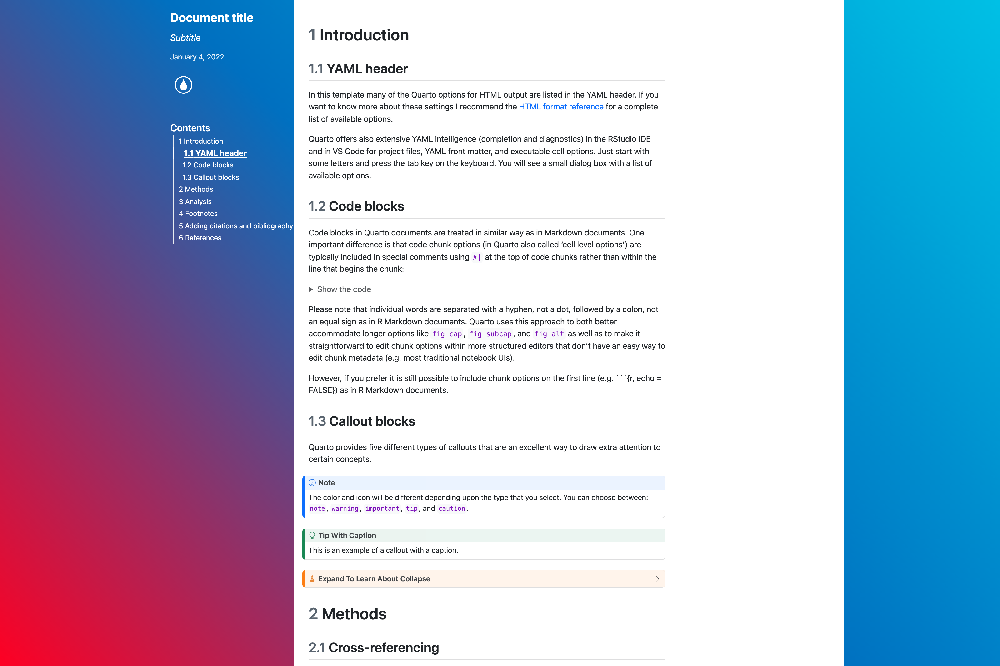

### Quarto: Simple Microsoft Word output format - `word`

→ for an example file see also
[here](https://github.com/gh-dhintz/GHformats/blob/master/resources/examples/demo_quarto_word.docx).

Similar to the R Markdown `word_doc` template, this Quarto template uses
a ‘gh-template.docx’ Word file with Guardant Health branding, with the
font type by default set to ‘HelveticaNeue’. You can choose the font in the
template by typing into the console

``` r
GHformats::create_qmd_doc(dirname = "choose-a-name", 
  template = "word")
```

More information is provided in the .qmd file. If you need additional
help, go to Quarto’s MS Word documentation:
<https://quarto.org/docs/output-formats/ms-word.html> If you feel like
using your own template or the standard Word template (i.e. the
Normal.dot file), simply provide the path to your file under
`reference-doc:` or comment/delete this line, respectively.

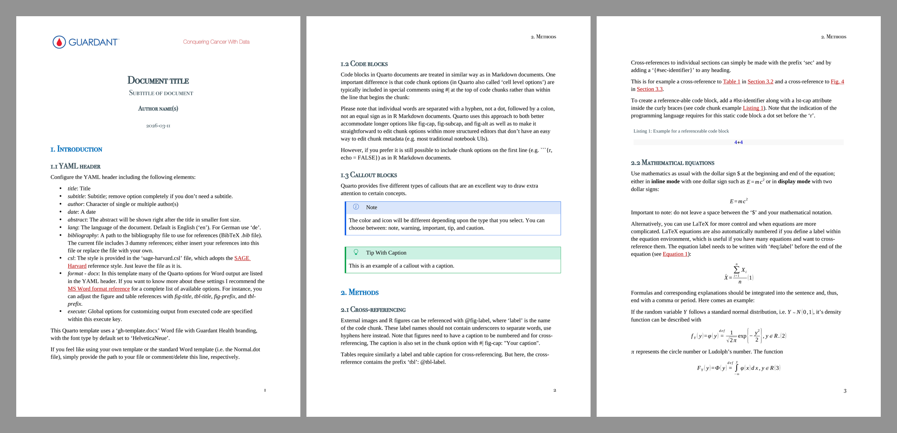

### Quarto: Output format for a simple PDF document in English (default) or German - `pdf_simple`

→ for an example file see also
[here](https://github.com/gh-dhintz/GHformats/blob/master/resources/examples/demo_quarto_pdf_simple.pdf).

This template converts the Quarto file into a simple PDF/LaTeX - based
document with a similar design than the R Markdown template
`pdf_simple`. You can choose here between two font types:
‘HelveticaNeue’ (default) and ‘Helvetica’. To create a subdirectory
including the Quarto template file, type into the console

``` r
GHformats::create_quarto_doc(dirname = "choose-a-name", 
  template = "pdf_simple", font = "HelveticaNeue")
```

More information is provided in the .qmd file. If you need additional
help, go to Quarto’s PDF documentation:
<https://quarto.org/docs/output-formats/pdf-basics.html>.

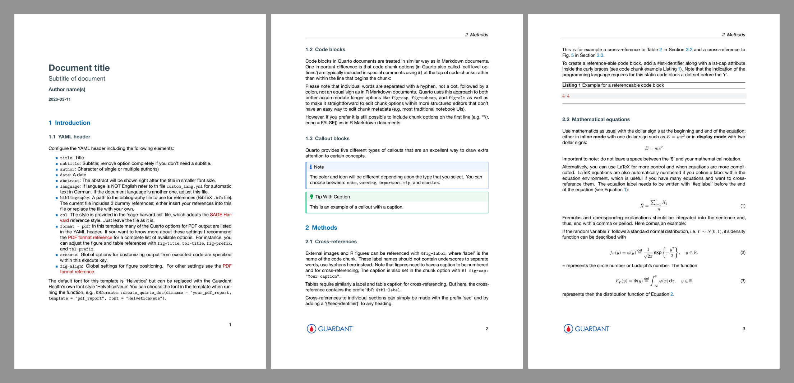

### Quarto: Output format for a PDF report in English (default) or German - `pdf_report`

→ for an example file see also
[here](https://github.com/gh-dhintz/GHformats/blob/master/resources/examples/demo_quarto_pdf_report.pdf).

If you want to have more a report style document choose as template
‘pdf_report’:

``` r
GHformats::create_quarto_doc(dirname = "choose-a-name", 
  template = "pdf_report", font = "HelveticaNeue")
```

The style of this template is similar to the R Markdown template
`pdf_report` except for the cover page and the title page. The cover
page can be adjusted using a different cover image and background and
text color. Also the Guardant Health logos on the title page can be replaced
with your own logos.

More information is provided in the .qmd file. If you need additional
help, go to Quarto’s PDF documentation:
<https://quarto.org/docs/output-formats/pdf-basics.html>.

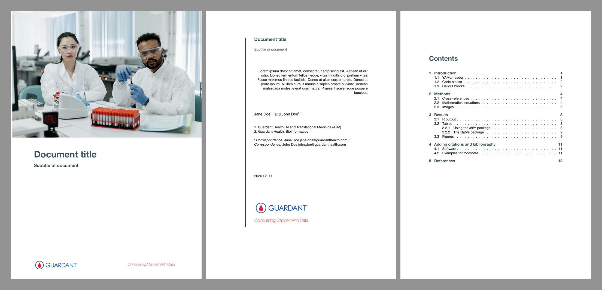

------------------------------------------------------------------------

## Useful resources

- R Markdown
  - The official [R Markdown
    documentation](https://rmarkdown.rstudio.com/lesson-1.html) from
    RStudio
  - R Markdown [reference
    guide](https://www.rstudio.com/wp-content/uploads/2015/03/rmarkdown-reference.pdf)
  - R Markdown
    [cheatsheet](https://github.com/rstudio/cheatsheets/raw/master/rmarkdown-2.0.pdf)
  - The online book [R Markdown: The Definitive
    Guide](https://bookdown.org/yihui/rmarkdown/) by Yihui Xie, J. J.
    Allaire, and Garrett Grolemund
- Quarto
  - The official [Quarto guide](https://quarto.org/docs/guide/)
  - Quarto’s [Gallery](https://quarto.org/docs/gallery/)
- LaTeX
  - The official [LaTeX help and
    documentation](https://www.latex-project.org/help/documentation/)
  - The [overleaf](https://www.overleaf.com/learn) documentation
- W3Schools Online Web Tutorial for
  [HTML](https://www.w3schools.com/html/default.asp) and for
  [CSS](https://www.w3schools.com/css/default.asp).

## For Developers

If you're contributing to this package and modifying templates, you'll need to regenerate the example files and preview images. Here's what you need:

### Required Dependencies

#### R Packages
- `GHformats` (this package)
- `rmarkdown`
- `knitr`
- `bookdown`
- `quarto`

```r
install.packages(c("rmarkdown", "knitr", "bookdown", "quarto"))
```

#### Python Dependencies
- Python 3.9+
- `playwright` (for HTML screenshots)
- `jupyter` and `nbconvert` (for Jupyter notebook conversion)
- `Pillow` (PIL, for image processing)

```bash
pip3 install playwright jupyter nbconvert Pillow

# Install Playwright browsers
python3 -m playwright install chromium
```

#### System Dependencies
- **LibreOffice**: Required for Word to PDF conversion
  - macOS: `brew install --cask libreoffice`
  - Linux: `sudo apt-get install libreoffice`
  - Windows: Download from [libreoffice.org](https://libreoffice.org/)

- **poppler-utils**: Required for PDF page extraction (`pdftoppm`)
  - macOS: `brew install poppler`
  - Linux: `sudo apt-get install poppler-utils`
  - Windows: Download from [poppler.freedesktop.org](https://poppler.freedesktop.org/)

- **Quarto CLI**: Required for Quarto templates
  - Download and install from [quarto.org](https://quarto.org/docs/get-started/)

### Regenerating Examples and Previews

After modifying any templates, regenerate all example files and preview images:

```r
Rscript scripts/regenerate_examples.R
```

This automated workflow will:
1. **Phase 1**: Render all R Markdown templates (HTML, PDF, Word, Jupyter)
2. **Phase 2**: Render all Quarto templates (HTML, PDF, Word)
3. **Phase 3**: Generate preview images for all templates
   - PDF/Word: 3x1 montages at 400 DPI
   - HTML/Jupyter: Single screenshots at high resolution with 2x scaling

**Output locations:**
- Example files: `resources/examples/demo_*.{html,pdf,docx,ipynb,zip}`
- Preview images: `vignettes/images/img_preview_*.png`

### Manual Script Execution

If you only need to regenerate preview images:

```bash
python3 scripts/generate_preview_montages.py
```

### Troubleshooting

- **Chrome crash errors**: The workflow uses Playwright's Chromium, which handles macOS compatibility issues better than system Chrome
- **LibreOffice not found**: Ensure `soffice` is in your PATH or installed in standard locations
- **PDF extraction fails**: Verify `pdftoppm` is installed and accessible
- **Jupyter conversion fails**: Ensure `jupyter nbconvert` works independently first

## Credits
1.  Saskia Otto [UHHformtas](https://github.com/uham-bio/UHHformats) package
2.  Julien Barnier’s [rmdformats](https://github.com/juba/rmdformats)
    package
3.  The [rticles](https://github.com/rstudio/rticles) package
4.  INWTlab’s [ireports](https://github.com/INWTlab/ireports) package
5.  Michael Kearney’s
    [rmd2jupyter](https://github.com/mkearney/rmd2jupyter) package
6.  Sarah Lang’s [LaTeX template for a cheat
    sheet](https://www.overleaf.com/latex/templates/colourful-cheatsheet-template/qdsshbjktndd)
7.  Eli Holmes’ [quarto titlepages template
    collection](https://nmfs-opensci.github.io/quarto_titlepages/) for
    the latest Quarto template to generate PDF report output.
